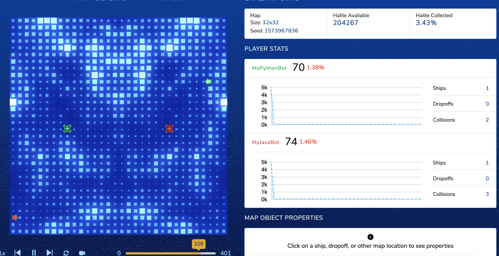

# Entry 02
##### 11/15/19

## Recap : My Progress

From the previous blog, I mentioned that I wanted to make an IOS app using swift with an interesting API. I then researched
about how to **GET** JSON data from the API using a GET HTTP request with swift code. Here are a few links to check out if you are
interested about this topic.
- Recommended : [Networking In Swift With URLSession](https://learnappmaking.com/urlsession-swift-networking-how-to/)
- More Complex : [Apple Developer Page : URLSession](https://developer.apple.com/documentation/foundation/urlsession)
- JSON Parsing : [JSON Parsing in Swift](https://medium.com/better-programming/json-parsing-in-swift-2498099b78f)
- Don't forget about the official developer site : [Working with JSON in Swift](https://developer.apple.com/swift/blog/?id=37)

Sample `URLSession` in use within a method `func forData()`
```Swift
import UIKit
var result = ""

class PostFOrData {
    // the completion closure signature is (String) -> ()
    func forData(completion:  @escaping (String) -> ()) {
        let url = URL(string: "https://opentdb.com/api_token.php?command=request")
        URLSession.shared.dataTask(with:url!, completionHandler: {(data, response, error) in
            guard let data = data, error == nil else { return }
            do {
                let json = try JSONSerialization.jsonObject(with: data) as! [String:Any]
                let posts = json["token"] as? String
                result = posts!
                let jsonString = "https://opentdb.com/api.php?amount=10&token=" + result
                completion(jsonString)
            } catch let error as NSError {
                print(error)
            }
        }).resume()
    }
}
```

What it really does is getting a response (in this example, string url) from the provided HTTP request

```
https://opentdb.com/api.php?amount=10&token=c3ccccfd78f7c441e704dbfaef634aac663d95d8e3bcf9a9758fe3fab4a280e2
```

Calling the method and getting my JSON data

```
let pfd = PostFOrData()

// you call the method with a trailing closure
pfd.forData { jsonString in
    // and here you get the "returned" value from the asynchronous task
    let url = URL(string: jsonString)
    print (url!)
    URLSession.shared.dataTask(with:url!, completionHandler: {(data, response, error) in
        guard let data = data, error == nil else { return }
        let posts = String(data: data, encoding: .utf8)
        print (posts!)
    }).resume()
}
```

response printed :

```
{"response_code":0,"results":[{"category":"General Knowledge","type":"multiple","difficulty":"easy","question":"What is the
largest organ of the human body?","correct_answer":"Skin","incorrect_answers":["Heart","large Intestine","Liver"]}...
```

## A Change in Topic

I have changed my mind and decided to go back to my initial idea for the Freedom Project : Halite AI coding. My Partner
[Felix Zhu](https://github.com/felixz2535) became interested in taking on the Halite AI Bot-making challenge, so the
two of us will make at least two bots (possibly more) to compete against one another along with top scoring bots made by halite
III winners.

## The _New_ Tool

We want to explore Python. As a dynamic programming language, Python is great for backend web development, data analysis,
artificial intelligence, and scientific computing. Python will help us be more efficient when dealing with variables.
We need efficient AI bot, and we would like to invest our time on Python.

In addition to the Python bot, we need another bot for it to compete against. Since we are learning java, we should create
a java bot for it to compete against. To test the full potential of our bot against other bots that didn’t involve us in
their development, we have to find the source code for Halite III participants. After we download their bots, we can compete
locally.

A great source to learn `python3` is [codecademy](https://www.codecademy.com/learn/learn-python-3), although it's `PRO` only.
`python2` is free and slightly different from `python3`. Another potential source will be
[learnpython.org](https://www.learnpython.org/)

## Engineering Design Process

The **problem** or **goal** for the Halite challenge is to make an AI bot such that it will figure out ways to gather the most
resources when competing against other bots. When the bot collects enough resources, it will need to learn how to spend these
recourses wisely so that the team will gain more points/resources.

**Research** : Going on the [Game Overview](https://2018.halite.io/learn-programming-challenge/game-overview) page, we learned
about the basic commands for a bot to return to the game. The [Documentation](https://2018.halite.io/learn-programming-challenge/api-docs)
page defines files and objects/functions provided in the starter kit which can be downloaded from the [Downloads](https://2018.halite.io/learn-programming-challenge/downloads) page.
Halite also provides a block-based coding environment for anyone to test out ideas: [Blockly](https://2018.halite.io/learn-programming-challenge/blockly/)

Our plans - **Brainstorm** : To create a successful bot, we need to plan out a list of actions that a bot should take when
facing certain situations. For instance, if a lot of Halite energy is nearby, the ship should go towards the area.

## Knowledge
In APCSA class, our current topic is `methods` which is essentially a member of a class. Both Python and Java are object orientated
programming languages, so `classes` and `methods` are important. Like Java, Python can `return` data of a specific type: ex. `int`.
However, unlike Java, Python can return multiple values easily. Java can only return multiple data of the same type within an
array.

Simple things like commands for compiling will be useful for this project if we make a secondary bot in Java.
We know that we need to run `javac MyBot.java` to compile all the `.java` files in order to execute the code (see Bot development section)

## Skills
Some skills that we further developed were our ability with **breaking down a task into smaller problems** and **researching** skills.
In order to even consider making an AI Bot, we needed to **learn** how to run the bot(s) with the game environment, a symmetrical
square or rectangular map with random distribution of Halite energy.

I was lost when we first started; just figuring out how to run the code was already tough because there wasn't a clear guide
on Halite's website. Clueless, we went to google and googled `how to run Halite locally` and decided to watch videos made by
Youtuber Sentdex.

Next, we downloaded Halite starter kits, and run the bot on the terminal just like Sentdex did. When we run, we saw that a
new file was created in the **replays** folder. We wondered **how exactly can we see the game _visually_** and so,
we visited [Halite's Watch-Game page](https://2018.halite.io/watch-games). We drop our .hlt (replay) file, and the game was
displayed. With that, we got the most basic and essential part of our project ready for the development of our bot.

## Bot Development
Sample Python starter code. Version 01 : "Brainless bot" ?

```python
while True:
    # This loop handles each turn of the game. The game object changes every turn, and you refresh that state by
    #   running update_frame().
    game.update_frame()
    # You extract player metadata and the updated map metadata here for convenience.
    me = game.me
    game_map = game.game_map

    # A command queue holds all the commands you will run this turn. You build this list up and submit it at the
    #   end of the turn.
    command_queue = []

    for ship in me.get_ships():
        # For each of your ships, move randomly if the ship is on a low halite location or the ship is full.
        #   Else, collect halite.
        if game_map[ship.position].halite_amount < constants.MAX_HALITE / 10 or ship.is_full:
            command_queue.append(
                ship.move(
                    random.choice([ Direction.North, Direction.South, Direction.East, Direction.West ])))
        else:
            command_queue.append(ship.stay_still())

    # If the game is in the first 200 turns and you have enough halite, spawn a ship.
    # Don't spawn a ship if you currently have a ship at port, though - the ships will collide.
    if game.turn_number <= 200 and me.halite_amount >= constants.SHIP_COST and not game_map[me.shipyard].is_occupied:
        command_queue.append(me.shipyard.spawn())

    # Send your moves back to the game environment, ending this turn.
    game.end_turn(command_queue)
```

Running Halite in Terminal `Python bot vs Java Bot`

```
Zhiyuans-MBP:Halite3_MacOS zhiyuan$ javac MyBot.java
Zhiyuans-MBP:Halite3_MacOS zhiyuan$ ./halite --replay-directory replays/ -vvv --width 32 --height 32 "python3 MyBot.py" "java MyBot"
```

Terminal then prints out...

```
[info] Map seed is 1573967836
[info] [P0] Launching with command python3 MyBot.py
[info] [P1] Launching with command java MyBot
[info] [P0] Initializing player
[info] [P1] Initializing player
[info] [P0] Initialized player MyPythonBot
[info] [P1] Initialized player MyJavaBot
[info] Player initialization complete
...
[info] [400] Game has ended
[info] Opening a file at replays/replay-20191117-001718-0500-1573967836-32-32.hlt
[info] Player 0, 'MyPythonBot', was rank 2 with 70 halite
[info] Player 1, 'MyJavaBot', was rank 1 with 74 halite
[info] [P0] Player has log output. Writing a log at replays/errorlog-20191117-001718-0500-1573967836-32-32-0.log
[info] [P1] Player has log output. Writing a log at replays/errorlog-20191117-001718-0500-1573967836-32-32-1.log
```

Loading .hlt file on Halite page



## Summary

Clearly both bots need **A LOT** of improvement.
- Bots begin with 5000 halite
- Every 1000 can summon 1 ship. When ships collide, they get destroyed.
- The bots ended with around 70 halite **by chance**.
- We should have at least 5000 if we began with 5000.

[Previous](entry01.md) | [Next](entry03.md)

[Home](../README.md)
