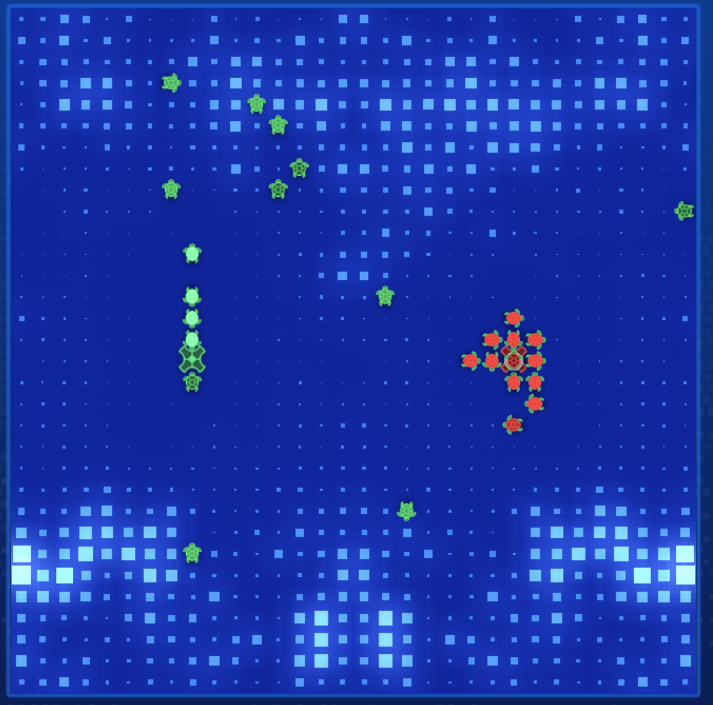

# Entry 03
##### 01/05/20

## Recap : My Progress

Since the previous blog entry, we have been learning from the starter code to break down what certain functions and constants refer to. This is extremely important to do because making our bot will be a much easier task if we utilize the functions provided such as `naive_navigate()`` which returns a direction for us to give to our ships to navigate to a specific location.

We have tinkered with functions like `get_surrounding_cardinals()` which returns a list of coordinates around us in 4 directions : North, South, East, West in that particular order.

## Engineering Design Process

We are currently brainstorming possible algorithms for the bot to follow and debug problems along the way. The most basic prototype has been created with the help of past Halite tutorials from [Youtuber Sentdex](https://pythonprogramming.net/). The next steps involve fixing each individual issue and starting the machine learning process to learn from the best moves bots make across hundreds of games.

## Knowledge

With the development of the bot requiring knowledge of tuples, dictionaries, and more, a lot of time will be spent on learning what each of these terminologies mean. It is no surprise that these words are just named something else in java. In our APCSA class, we have learned what an `object` is. Objects have characteristics and a value is assigned to each of them. Similarly, dictionaries are similar to objects at storing data with the format of `key : value`. I learned about dictionaries from [w3schools](https://www.w3schools.com/python/python_dictionaries.asp). Tuples are lists that cannot be modified in any way. In Java, that would be a `final array` because arrays cannot be modified in terms of their size and the `final` characteristic saves it as a constant. As I watch tutorial videos, certain keywords/functions like `enumerate()` were not explained. I googled and read about enumerate() on [GeeksforGeeks](https://www.geeksforgeeks.org/enumerate-in-python/). I learned that `enumerate()` is a nice way to iterate through dictionaries.

## Skills

Some skills that I have developed were skills like what to google (searching skills). There will be many tutorials out there for me to learn from and get inspiration so knowing how to find these resoruces is an important skill. Another skill that was involved in the development of the bot's current version was debugging. Sometimes typos happen while we code, and the terminal will not produce our anticipated outputs but rather long chains of text, displaying the errors. The terminal will highlight the chunk of code that didn't run/compile properly, and I can go directly to that section to understand what went wrong. Learning to read and be patient is important here.

## Bot Development

Version 02 : Collector Bot

Every ship knows when to collect and head back to shipyard to deposit.

```python
ship_states = {}

while True:
    # This loop handles each turn of the game. The game object changes every turn, and you refresh that state by
    # running update_frame().
    game.update_frame()
    # You extract player metadata and the updated map metadata here for convenience.
    me = game.me
    game_map = game.game_map

    # A command queue holds all the commands you will run this turn. You build this list up and submit it at the
    # end of the turn.
    command_queue = []

    # get_surrounding_cardinals() returns the surrounding coordinates in the following direction order
    direction_order = [Direction.North, Direction.South, Direction.East, Direction.West, Direction.Still]

    # store the coordinates of all ships considering where they will move to avoid crashing.
    coordinates = []
    for ship in me.get_ships():

        # all new ships will be collecting halite
        if ship.id not in ship_states:
            ship_states[ship.id] = "collecting"

        if ship_states[ship.id] == "collecting":
            # from positionals.py.

            # provides the coordinates of all options/moves (NSEW) excluding staying still
            options = ship.position.get_surrounding_cardinals() + [ship.position]

            # pos = {(0, -1): Position(8, 15), (-1,0) : Position(7, 16) ...}
            # pos dictionary : maps direction (NSEW) to a Position(coordinate)
            pos = {}

            # energy dictionary : maps the direction choice with halite
            # energy = {(0, -1): halite, (0, 1): halite ...}
            energy = {}

            for n, direction in enumerate(direction_order):
                pos[direction] = options[n]

            for direction in pos:
                position = pos[direction]
                halite_amount = game_map[position].halite_amount

                # the position of the direction we are planning to move will not be taken over by another ship
                # we will consider each of the available directions for movement
                if pos[direction] not in coordinates:
                    # we prefer to stay still to collect remaining halite
                    if direction == Direction.Still:
                        halite_amount *= len(me.get_ships())
                    energy[direction] = halite_amount

            directional_choice = max(energy, key=energy.get)
            coordinates.append(pos[directional_choice])

            command_queue.append(ship.move(game_map.naive_navigate(ship, ship.position + Position(*directional_choice))))

            if ship.halite_amount >= constants.MAX_HALITE * 0.75:
                ship_states[ship.id] = "depositing"

        else:
            move = game_map.naive_navigate(ship, me.shipyard.position)
            upcoming_position = ship.position + Position(*move)
            if upcoming_position not in coordinates:
                coordinates.append(upcoming_position)
                command_queue.append(ship.move(move))
                if move == Direction.Still:
                    ship_states[ship.id] = "collecting"
            else:
                coordinates.append(ship.position)
                command_queue.append(ship.move(game_map.naive_navigate(ship, ship.position+Position(*Direction.Still))))

    # ship costs 1000, dont make a ship on a ship or they both sink
    if len(me.get_ships()) < math.ceil(game.turn_number / 25):
        if me.halite_amount >= 1000 and not game_map[me.shipyard].is_occupied:
            command_queue.append(me.shipyard.spawn())

    # Send your moves back to the game environment, ending this turn.
    game.end_turn(command_queue)
```

Running on halite outputs the following :

```bash
[info] Map seed is 1578261423
[info] [P0] Launching with command Python3 MyBot.py
[info] [P1] Launching with command Python3 MyBot.py
[info] [P0] Initializing player
[info] [P1] Initializing player
[info] [P0] Initialized player ZF-PythonBot
[info] [P1] Initialized player ZF-PythonBot
[info] Player initialization complete
[warn] [3] [P1] entity 0 was directed to use 11 halite to move east, but only 0 halite was available
[warn] [3] [P0] entity 1 was directed to use 11 halite to move west, but only 0 halite was available
[warn] [5] [P1] entity 0 was directed to use 23 halite to move east, but only 21 halite was available
[warn] [5] [P0] entity 1 was directed to use 23 halite to move west, but only 21 halite was available
[warn] [28] [P1] entity 2 was directed to use 8 halite to move east, but only 0 halite was available
...
[info] [400] Game has ended
[info] Opening a file at replays/replay-20200105-165704-0500-1578261423-32-32.hlt
[info] Player 0, 'ZF-PythonBot', was rank 2 with 10046 halite
[info] Player 1, 'ZF-PythonBot', was rank 1 with 12120 halite
[info] [P0] Player has log output. Writing a log at replays/errorlog-20200105-165704-0500-1578261423-32-32-0.log
[info] [P1] Player has log output. Writing a log at replays/errorlog-20200105-165704-0500-1578261423-32-32-1.log

```

## Summary

Note that we are fighting ourselves (two duplicates of the same bot) but we still result in different halite collected despite the actions taken are mirror images of one another (in the early game).

Things to know
- Bots begin with 5000 halite
- Every 1000 halite can summon 1 ship. When ships collide, they get destroyed.

We ended with 10k and more halite. That's a lot of improvement from the first brainless bot. However, there are issues with depositing. As all the ships gain halite, they want to drop off their halite at the shipyard. This results in a crowd. The ship at the base will be surrounded by its team and cannot move to any spot based on our current logic. We will need to look into solving that problem (check out the image below)


Loading .hlt file on Halite page




[Previous](entry02.md) | [Next](entry04.md)

[Home](../README.md)
