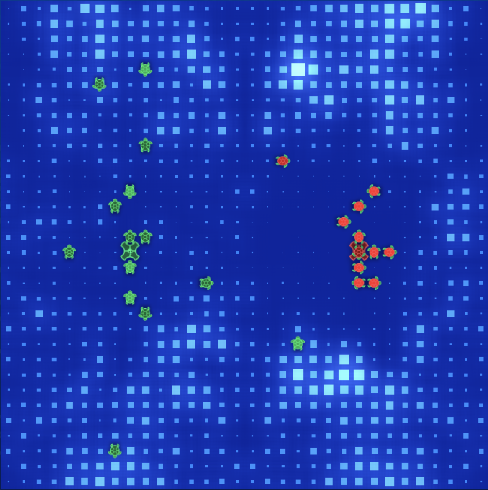

# Entry 04
##### 2/9/20

## A little recap from previous entry...

Previously on the Freedom Project, we said
> "However, there are issues with depositing. As all the ships gain halite, they want to drop off their halite at the shipyard. This results in a crowd. The ship at the base will be surrounded by its team and cannot move to any spot based on our current logic. We will need to look into solving that problem"

Some new things that we considered :
- `game_map.naive_navigate(position, destination)` is good but not good enough. We decided to abandon this naivgation method that was provided to us. Naive navigate only considers a move if the current target cell is not occupied. This is why it's called "naive" because when the next turn comes, the target cell's ship would have likely moved.
- We moved on to using `GameMap._get_target_direction(position, destination)`. In short, this other method provides at most two directions to move towards our destination. For example, if we are at (0,0) and we want to move to (1,1), by calling `_get_target_direction()`, we will have two directions to decide : South and East.
- As of right now, we are not thinking of making dropoffs, but just in case we do in the future, we have to make a new function that finds the nearest "base" for a ship to deposit. See `nearestBase(pos)` method
- The one and **ONLY** way to win the game is to get the most halite within a certain number of turns (400 to 500 depending on map size). Therefore, we need all ships to hunt for the highest halite cells. Obviously, we need to consider the distance to that cell too. We made a few functions to take care of this.

## Engineering Design Process

Our overall progress in the Freedom Project is between **creating a prototype** (bot versions), **testing and evaluate the prototype** (running it against previous models, other player's bots, and fighting itself) and lastly **improve as needed** (better algorithms, methods, ships need to become more aggressive and protective)

In order to evaluate our bot's ability, we upload our replay file and check the percentage of halite collected throughout the whole game.

## Knowledge

In calling methods like `_get_target_direction()`, we need to understand the type of method it is. In both Java and Python, methods can be static. Static methods belong to the class not an instance of the class. Therefore, we can call the method without creating an object from the class with the following syntax : `ClassName.method()` rather than `object.method()`

For this project, we have to work with integers for the most part. Additionally, we often needed to convert data types to strings to print to a text file for us to gather data. Therefore, data casting is important.

In Java, casting to an integer looks like this

```java
int x = (int) (12/5);   // expected stored number is 2 because 2.4 is truncated to 2 after casting from double to int
```

In Python,
```python
x = int(12/5)   # this will store 2 into x.
print(str(x))   # converts x to a string form of x, necessary for concatenation.
```

We needed int() to make sure our numbers were easy to work with, especially halite values are all integers.

## Skills

Some skills that I further developed were my ability to google my question online. I approached StackOverflow for simple techniques to extract values from dictionaries. I googled **how to get key from values** and clicked on some suggestions, one of which came from [a stackoverflow discussion from 8 years ago](https://stackoverflow.com/questions/8023306/get-key-by-value-in-dictionary). Prior to finding that, I read a solution from [geeksforgeeks](https://www.geeksforgeeks.org/python-get-key-from-value-in-dictionary/). At first, the first solution presented did not appeal to me. It turns out the second method listed there was the same as that from stackoverflow. The biggest skill is problem decomposition, as you can see from the breakdown of our goal to implementing each individual small method/function.

## Bot Development

Version 03 : Smart Collector Bot

#### Step 1 : How many halite do we have ?

Since halite is spread throughout the entire map, we need to find the total by assessing the value of `.halite_amount` from each individual cell. We can loop through the entire map size (n x n) or divide the map into chunks.

Our solution : Divide the map into chunks of 4 x 4 "zones" and add the halite available from each zone to find the total halite in this map.
In the code below, you may **ignore the fill optional parameter** for now.

```python
# returns the amount of halite in an area block of size 4 x 4
# param : x,y should be the coordinate of the very left corner of the zone.

def haliteInZone(x,y,fill = None):
    areaHalite = 0
    zoneNum = int(y/4 * game_map.width/4 + x/4)
    if fill is not None:
        zonePosition.update({zoneNum : Position(x,y)})
    for i in range (x, x+4):
        for j in range(y, y+4):
            if fill is not None:
                coordsToZone.update({Position(i,j) : zoneNum})
            areaHalite += game_map[Position(i,j)].halite_amount
        zoneHalite.update({zoneNum : areaHalite})
    return areaHalite
```

To get the number of halite in the entire map :

```python
# returns the amount of halite in the entire map
# param : fill = boolean (True only for initial), reduce run time with None.

def haliteInMap(fill = None):
    haliteRemaining = 0
    for y in range(0, game_map.height, 4):
        for x in range(0, game_map.width, 4):
            if fill is None:
                haliteRemaining += haliteInZone(x,y)
            else:
                haliteRemaining += haliteInZone(x,y,fill)
    return haliteRemaining
```

#### Step 2 : Where should a ship go to collect halite, given we know the halite numbers of the entire map ?

We figured that ships should approach the area with the highest "worth"

Our formula : `worth = halite / distance`

To find that value, we needed to know `halite` and `distance`. We have `halite`, but we do not have a `distance` value.

To find distance from a ship to a position, we can use `game_map.calculate_distance(pos, destination)`

```python
# returns a list of average distances to each particular zone
# param : ship = current ship [access position]

def averageDistance(ship):
    distanceToZones = []
    # p is a Position(i,j) class object
    for p in zonePosition.values():
        distance = 0
        # iterate over the 4 x 4 grid starting from the corner
        for px in range (p.x, p.x + 4):
            for py in range (p.y, p.y + 4):
                distance += game_map.calculate_distance(ship.position, Position(px,py))
        distance = int(distance/16)
        distanceToZones.append(distance)
    return distanceToZones
```

next when we have the distance value, we need to define a function for "worth"

```python
# returns a list of values taken from halite in zone divided by average distance to zone
# params : ship = current ship [access position]

def areaWorth(ship):
    distanceArray = averageDistance(ship)
    worth = []
    for areaCode, halite in zoneHalite.items():
        worth.append(round(3*halite/(distanceArray[areaCode]),2))
    return worth
```

Our formula was manipulated to 3 times the amount of halite divided by average distance. The "3" is an arbitrary number that we decided on so that the ship cares more about halite than distance. We might have to revisit that later.

When a ship moves away from its base, it needs to have a destination. We called it a new destination.

```python
def newDestintation(ship):
    # declare ship's destination as unknown
    myDestination = None
    worth = areaWorth(ship)
    targetZones = {}

    # populate the targetZones dictionary with pair values of "zone number" and its worth
    # destinationZones.values() returns the zones that are taken by other ships. To avoid conflict, all ships should find a different
    place to go to. We WILL DEFINITELY revisit this idea. This is not an issue because the minimum number of zones in the smallest map is 64.

    for i in range(0, len(worth)):
        if i not in destinationZones.values():
            targetZones.update({i : worth[i]})
    targetZone = []

    # the max() function returns the maximum value of a given iterable
    maxWorth = max(targetZones.values())

    # extract the zone number given its corresponding worth value
    for k,v in targetZones.items():
        if v == maxWorth:
            targetZone.append(k)
    targetZone = targetZone[0]
    destinationZones.update({ship.id : targetZone})

    # startCoord stores the very top left position of a 4 x 4 area
    startCoord = zonePosition[targetZone]
    haliteLevel = 0;
    for i in range(startCoord.x, startCoord.x+4):
        for j in range(startCoord.y, startCoord.y+4):
            if game_map[Position(i,j)].halite_amount > haliteLevel:
                haliteLevel = game_map[Position(i,j)].halite_amount
                myDestination = Position(i,j)
    destinations[ship.id] = myDestination
```

Now that we have all the functions we need, it's time to implement them into our code. We will upload our full code into our repository, and it would be too long to paste it all here.

```python
for ship in me.get_ships():
    ### code not shown ...

    if destinationZones[ship.id] == -1:
        newDestintation(ship)

    if ship_states[ship.id] == "collecting":
        myDestination = destinations[ship.id]
        upcoming_position = None
        directional_choice = None;
        if ship.position != myDestination and not shipArrived[ship.id]:
            toTargetChoices = GameMap._get_target_direction(ship.position, myDestination)
            directionalChoices = []
            for t in toTargetChoices:
                if t is not None:
                    directionalChoices.append(t)
            oppositeDirectionalChoices = [Direction.invert(d) for d in directionalChoices]
            for directional in directionalChoices:
                upcoming_position = ship.position.directional_offset(directional)
                if upcoming_position not in coordinates:
                    if game_map[ship.position].halite_amount == 0 or ship.halite_amount > int(game_map[ship.position].halite_amount/constants.EXTRACT_RATIO):
                        coordinates.append(upcoming_position)
                        directional_choice = directional
                        break;
            if directional_choice is not None:
                command_queue.append(ship.move(directional_choice))
            else:
                # if moving towards destination is not allowed, check to either move in oppsite direction when staying still is not allowed
                # Case 1 : ship's current position will be occupied : MUST MOVE
                # NEXT STEPS : what if we must move but we can't move due to lack of halite, tell whichever ship that will occupy our cell to not move here.
                if ship.position in coordinates:
                    for directional in oppositeDirectionalChoices:
                        upcoming_position = ship.position.directional_offset(directional)
                        if upcoming_position not in coordinates:
                            if game_map[ship.position].halite_amount == 0 or ship.halite_amount > int(game_map[ship.position].halite_amount/constants.EXTRACT_RATIO):
                                coordinates.append(upcoming_position)
                                directional_choice = directional
                                break;
                    if directional_choice is not None:
                        command_queue.append(ship.move(directional_choice))
                    else:
                        coordinates.append(ship.position)
                        command_queue.append(ship.move(Direction.Still))

                # Case 2 : ship's location will currently not be occupied, so we can stay still.
                else:
                    coordinates.append(ship.position)
                    command_queue.append(ship.move(Direction.Still))
    else:
        ### code not shown
```

In our terminal we run the command : our current version is stored in `MyBotcopy.py` while `MyBot.py` is the previous bot version.

```bash
Zhiyuans-MBP:Halite3_MacOS zhiyuan$ ./halite --replay-directory replays/ -vvv --width 32 --height 32 "Python3 MyBotcopy.py" "Python3 MyBot.py"
```

The following are the outputs : note errors for [P0] which is our bot. We faced several collisions (something that we need to fix later on).

```bash
[info] Map seed is 1581282445
[info] [P0] Launching with command Python3 MyBotcopy.py
[info] [P1] Launching with command Python3 MyBot.py
[info] [P0] Initializing player
[info] [P1] Initializing player
[info] [P0] Initialized player TrialBot03
[info] [P1] Initialized player ZF-PythonBot
[info] Player initialization complete
[warn] [240] [P0] owned entities 15, 9 collided on cell (8, 21) as the result of moves on this turn
[warn] [293] [P0] owned entities 13, 5 collided on cell (8, 20) as the result of moves on this turn
[info] [400] Game has ended
[info] Opening a file at replays/replay-20200209-160727-0500-1581282445-32-32.hlt
[info] Player 0, 'TrialBot03', was rank 1 with 17262 halite
[info] Player 1, 'ZF-PythonBot', was rank 2 with 12491 halite
[info] [P0] Player has log output. Writing a log at replays/errorlog-20200209-160727-0500-1581282445-32-32-0.log
```

Click image for the video of that round (at 5x speed)

[](../haliteV03.mp4)

Stay Tuned for the next bot version !

[Previous](entry03.md) | [Next](entry05.md)

[Home](../README.md)